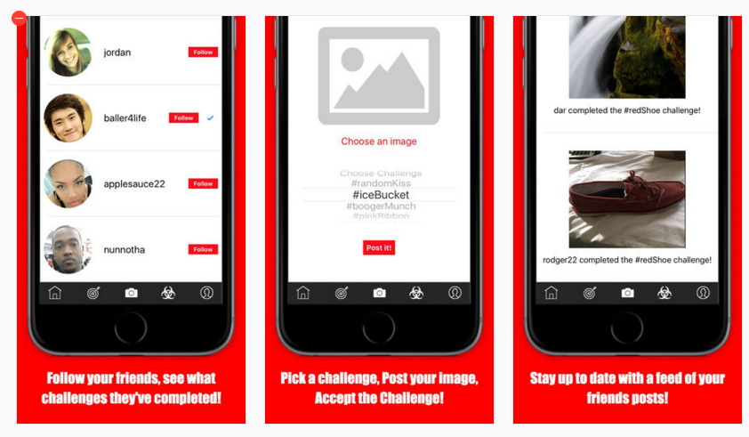

# PiqChallenge
Social Media Application that enables users to complete social challenges and share with friends

##Technology Stack
|  | 
------------ | ------------- | -------------
Swift 2.2 | Objective-C | Xcode 7.2

##Application Overview

##Using and viewing this project
####Requirements:
Xcode 7+

1. To Get started, download zip to your local maching or fork this repo and clone down
2. Open project in Xcode
3. Choose device to view app with
4. Click the Build button to open app on simulated device
5. Enjoy!
